# Reaper Switchwire Carriage

A custom version of the Reaper carriage designed for **Voron Switchwire** conversions.

I wanted to use the Reaper toolhead on my Switchwire conversion, so I designed this carriage with the help of [APDMachine](https://github.com/APDMachine).

---

## Overview

This carriage is currently **only compatible with the Klicky Probe and sensorless homming**:

- [Klicky Probe (Switchwire version)](https://github.com/jlas1/Klicky-Probe/tree/main/Printers/Voron/Switchwire) ( shortened arms required )

More probing solutions may be added in the future based on community feedback.

---

## Features

- Detachable belt clips for easier belt installation and maintenance  
- Integrated Klicky Probe mount 
- Support-free main parts (belt clips require supports)

---

## Required Hardware

To assemble the carriage, you will need:

- 5 × M3 heat-set inserts  
- 2 × M3 × 30 mm screws  
- 1 × M3 × 15 mm screw  
- 3 × 6 × 3 mm magnets  
- Wiring for the probe  
- All printed parts  

---

## Recommended Print Settings

These settings follow the **Voron Design guidelines** for functional mechanical parts.

### 3D Printing Process
- FDM (Fused Deposition Modeling)

### Material
- ABS or ASA (required)

### Layer Settings
- Layer height: 0.2 mm
- Extrusion width: 0.4 mm (forced)

### Infill
- Type: Grid / Gyroid / Honeycomb / Triangle / Cubic  
- Density: 40%

### Walls
- Wall count: 4

### Top / Bottom Layers
- Top layers: 5
- Bottom layers: 5

### Notes
- These settings prioritize strength over speed or material usage  
- Use an enclosure for ABS/ASA  
- Poor layer adhesion will reduce mechanical strength significantly  

---

## Printing Notes

- Print all parts in the orientation provided in the STL files  
- No supports required for main parts  
- Supports required only for belt clips

---

## Assembly

<u>1. Heat-set inserts :</u>

- install the 5 heatset insterts as shown in the pictures below.

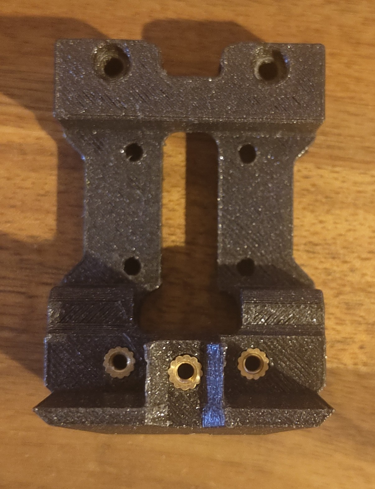 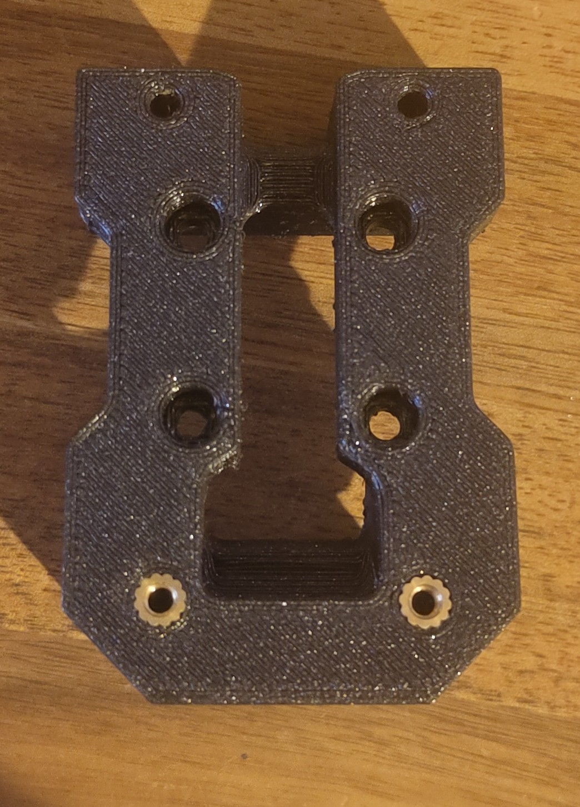

<u>2. Klicky assembly</u>

- strip the wires on 20mm.

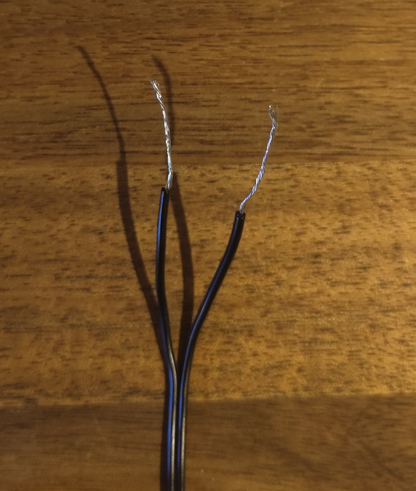

- pass them through the holes and wind them as shown in the pictures below.

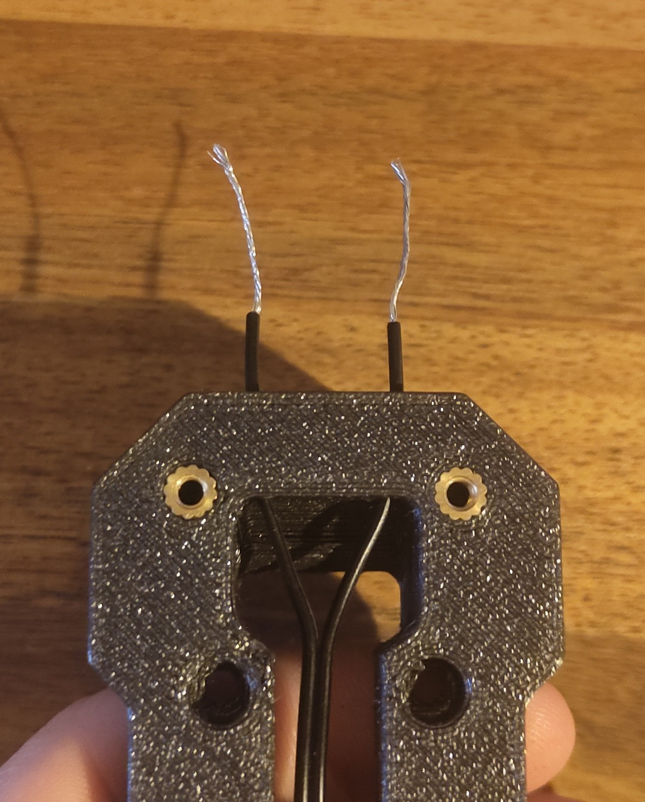 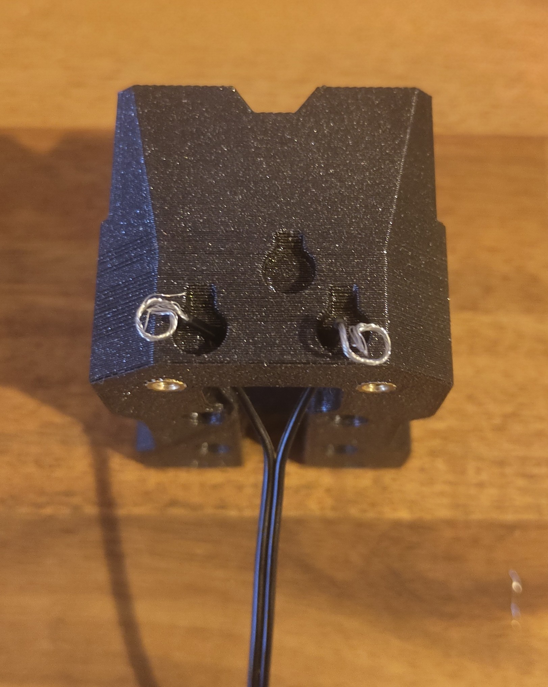 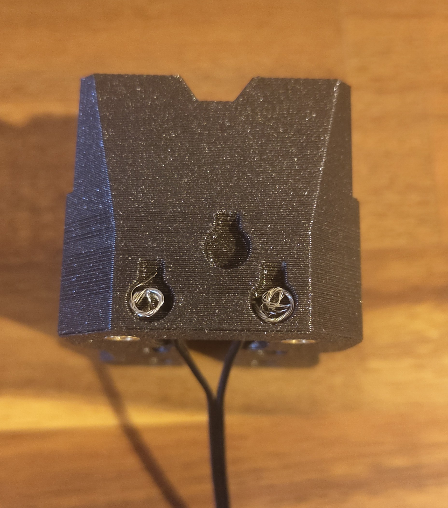

- put the magnets on the probe to make sure they will be installed the right way and press them in the holes

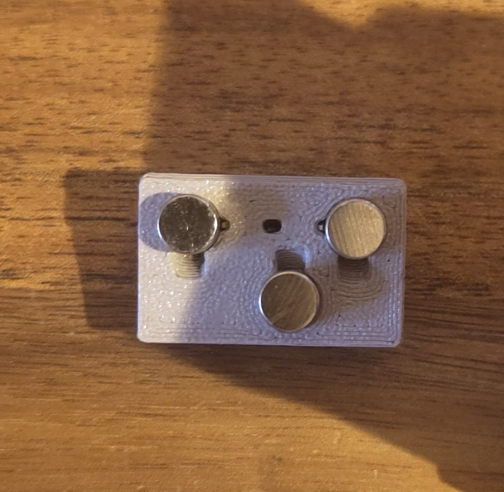 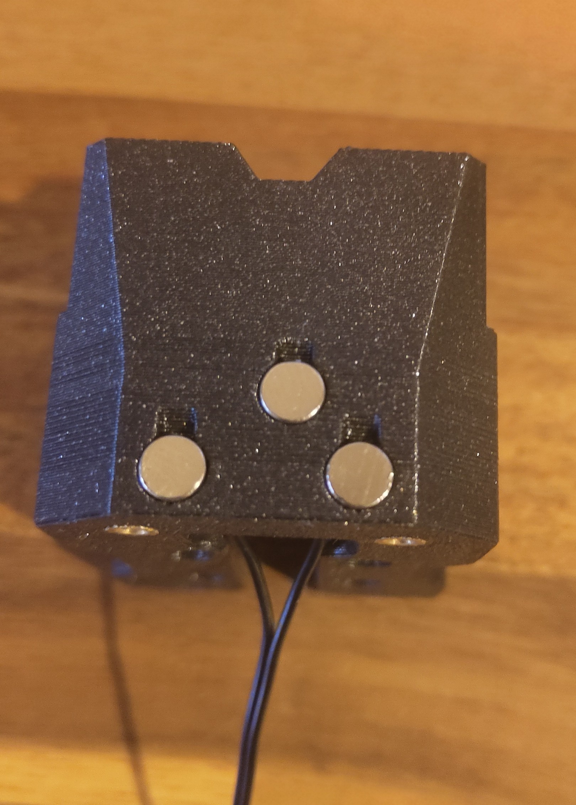

<u>3. belt clips assembly</u>

- install the rear part of the carriage using the center screw ( M3 x 15mm ) do not tighten it

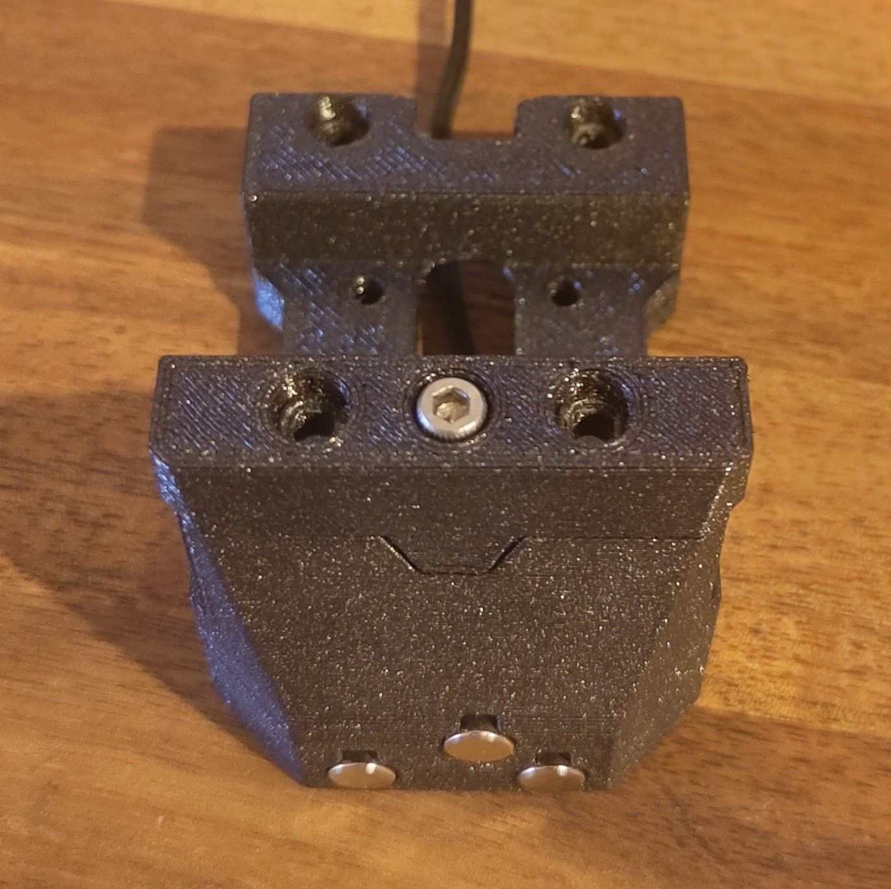

- install the belts in the clips as shown below ( the brown part of the lower belt part should be facing up when installed on the printer )

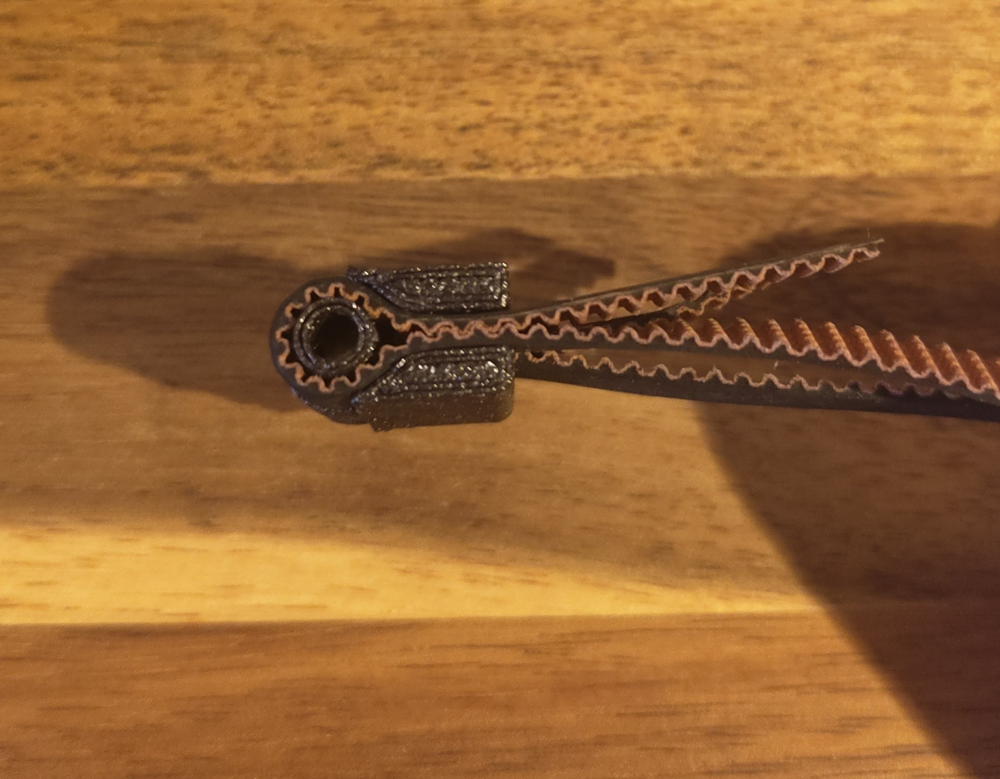

- put the clips in place and using the two M3 x 30mm screws

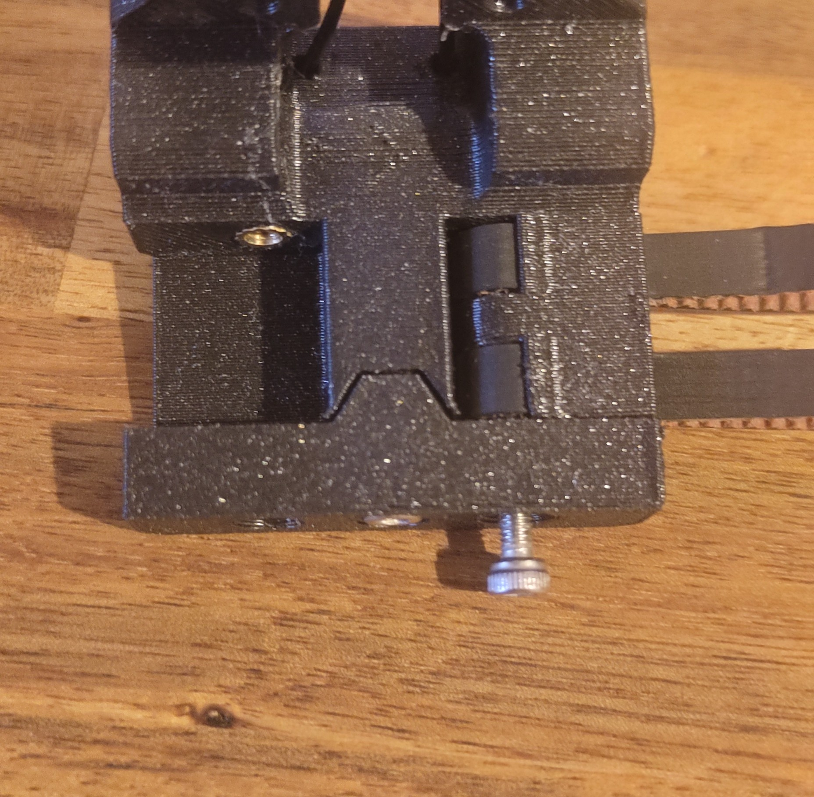

- tighten the three screws

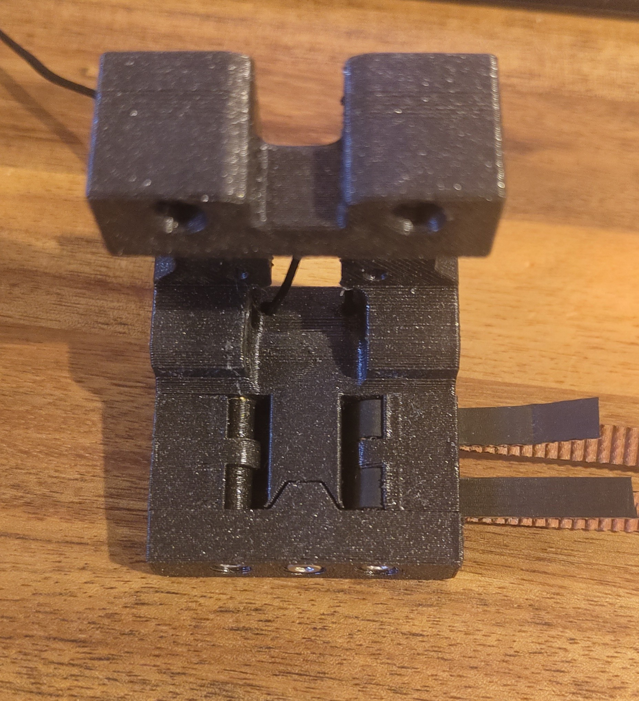

<u>4. follow the [Installation Manual](https://github.com/APDMachine/Reaper/blob/main/Manual/Manual.pdf) to finish the toolhead assembly</u>

---

## Compatibility

- Voron Switchwire  
- Reaper Toolhead  
- Klicky Probe (Switchwire version only for now)

---

## Credits

Special thanks to [APDMachine](https://github.com/APDMachine) for guidance and support during the design process.

Feedback and suggestions are welcome.
